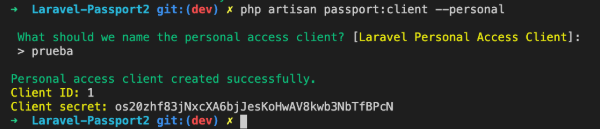
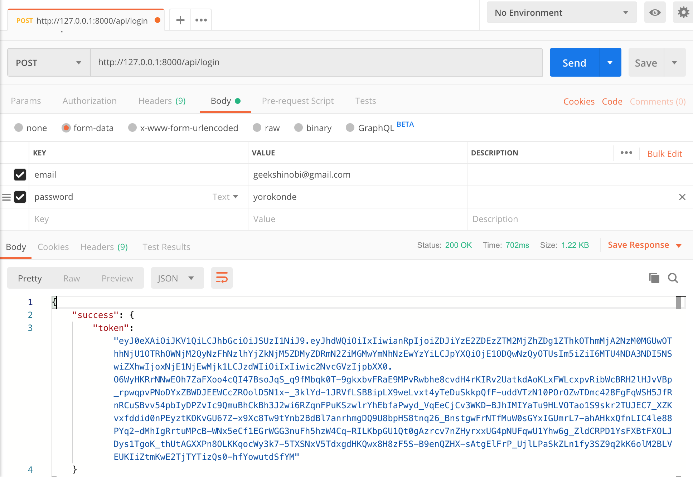
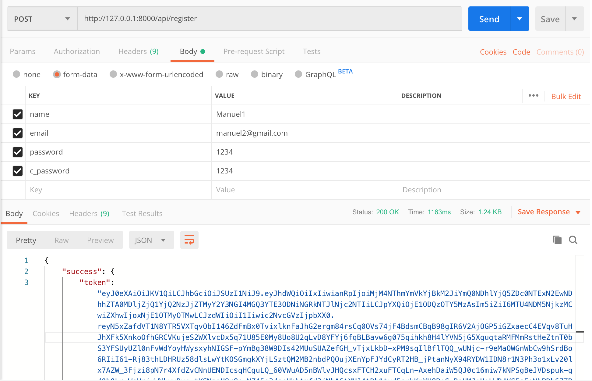
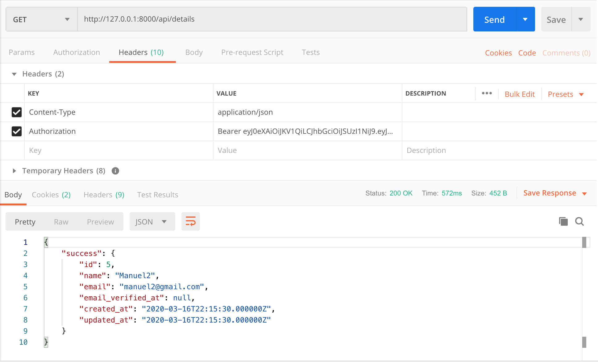

<p align="center"></p>

<p align="center">
<a href="https://packagist.org/packages/laravel/framework"></a>
</p>

## Configuración rapida

**Configurar Base de datos**

Editamos los datos de conexión del archivo .env:

```env
DB_CONNECTION=mysql
DB_HOST=127.0.0.1
DB_PORT=8889
DB_DATABASE=passport
DB_USERNAME=root
DB_PASSWORD=root
```

**Instalamos passport:**

``composer require laravel/passport``

**Creamos token personal**
Nos pedira un nombre escribimos: **prueba**
``php artisan passport:client --personal``
<p align="center"></p>

**Realizamos las consultas a la api**
[Consultas de api](#consultaapi)

Esta fue la configuración rapida.


## Configuración completa

### Editamos el .env

Editamos los datos de conexión del archivo .env:

```env
DB_CONNECTION=mysql
DB_HOST=127.0.0.1
DB_PORT=8889
DB_DATABASE=passport
DB_USERNAME=root
DB_PASSWORD=root
```

### Configuración para base de datos
Esta configuración solo es requerida si tu versión de base de datos es menor.

Si está ejecutando una versión de MySQL anterior a la versión 5.7.7 o MariaDB anterior a la versión 10.2.2, es posible que deba configurar manualmente la longitud de cadena predeterminada generada por las migraciones para que MySQL cree índices para ellos.

***app/Providers/AppServiceProvider.php***
```php
<?php
namespace App\Providers;
use Illuminate\Support\ServiceProvider;
// usamos Schema Facades
use Illuminate\Support\Facades\Schema;
class AppServiceProvider extends ServiceProvider
{
   /**
    * Register any application services.
    *
    * @return void
    */
   public function register(){}
   /**
    * Bootstrap any application services.
    *
    * @return void
    */
   public function boot()
   {
       // Agregamos esta linea para la longitud
       Schema::defaultStringLength(191);
   }
}
```
Ejecutamos la migración:

``php artisan migrate``

En este momento ya tenemos la configuración inicial para la conexión de la base de datos.


## Instalamos Passport

``composer require laravel/passport``

### Ejecutamos las nuevas migraciones

``php artisan migrate``

### Creamos llaves de cifrado

``php artisan passport:install`` 

***Esta es la posible respuesta de acceso que nos regresa el comando:***
```
Respuesta de la terminal:
Encryption keys generated successfully.
Personal access client created successfully.
Client ID: 1
Client secret: Cu6uSyYXxtx7ia56lxgy1iQ7E7zz9xpRnHdejngf
Password grant client created successfully.
Client ID: 2
Client secret: LJ8hshaApa3SbOl8cQ5IUyGCYxkBJo3mbUfZMtiM
```

## Configuración de laravel/ui y Vue auth

Ejecutamos los siguientes comandos en terminal:

``composer require laravel/ui``
``php artisan ui vue --auth``

Una vez terminado ejecutamos el siguiente comando:

``npm install && npm run dev``

### Creamos componentes de vue

``php artisan vendor:publish --tag=passport-components``

#### Editamos resources/views/home.blade.php

```php
@extends('layouts.app')
@section('content')
<div class="container">
   <div class="row justify-content-center">
       <div class="col-md-8">
           <div class="card">
               <div class="card-header">Dashboard</div>
 
               <div class="card-body">
                   @if (session('status'))
                       <div class="alert alert-success" role="alert">
                           {{ session('status') }}
                       </div>
                   @endif
                   You are logged in!
               </div>
           </div>
           <passport-clients></passport-clients>
           <passport-authorized-clients></passport-authorized-clients>
           <passport-personal-access-tokens></passport-personal-access-tokens>
       </div>
   </div>
</div>
@endsection
```

Ejecutamos en terminal

``php artisan serve``
``npm run dev``
``php artisan migrate:refresh``

Por ultimo accedemos a la url [http://127.0.0.1:8000/](http://127.0.0.1:8000/)

Ahora ya puedes registrar un usuario y registrar sus token de acceso

## Token de acceso por API

### Configuramos token de acceso personal

Primero debe crear clientes de acceso. Está documentado [aquí](https://laravel.com/docs/6.x/passport#creating-a-personal-access-client). Un cliente de acceso no es lo mismo que un token de usuario, puede tener un cliente de acceso y muchos usuarios con diferentes contraseñas y tokens.

`php artisan passport:client --personal`

Al ejecutar el comando nos pide un nombre para el personal access client escribimos: ***Prueba***

<p align="center"></p>

### Rutas api.php 
En api.php tenemos las siguientes rutas:
```php
Route::post('login', 'UserController@login');
Route::post('register', 'UserController@register');
Route::group(['middleware' => 'auth:api'], function(){
   Route::get('details', 'UserController@details');
});
```

## Consultas al api {#consultaapi}
Antes de realizar un login recuerda que primero debes agregar un usuario ya sea en el apartado visual [http://127.0.0.1:8000/register](http://127.0.0.1:8000/register) o por el api **Register**.

### Login
[http://127.0.0.1:8000/api/login](http://127.0.0.1:8000/api/login)
<p align="center"></p>

### Register
[http://127.0.0.1:8000/register](http://127.0.0.1:8000/register)
<p align="center"></p>

### Details

[http://127.0.0.1:8000/api/details](http://127.0.0.1:8000/api/details)
<p align="center"></p>

<p align="center"></p>